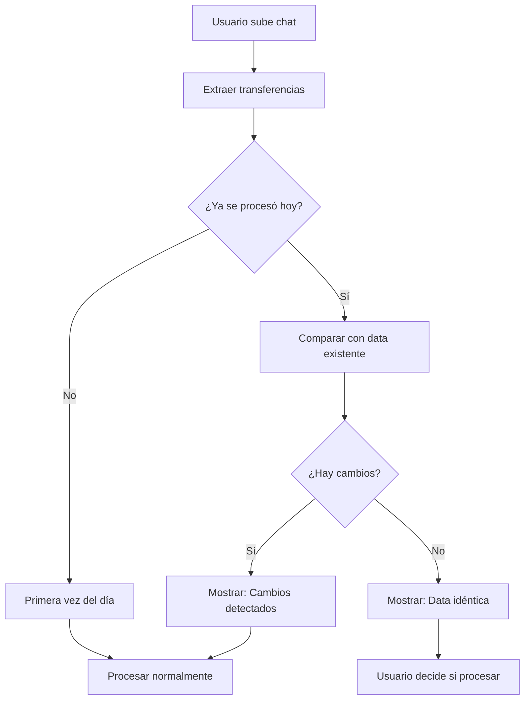
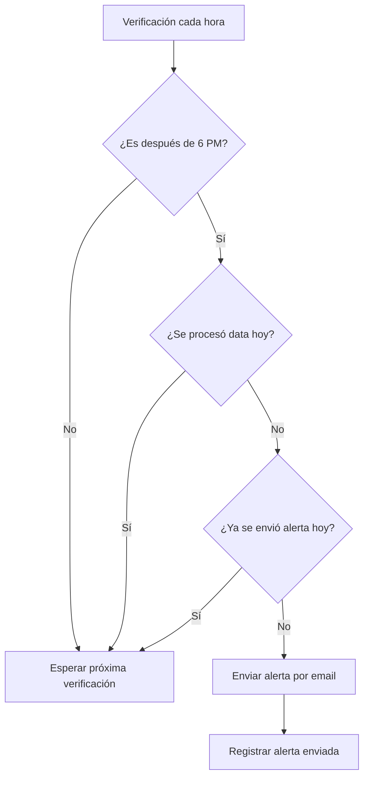

# 🚨 Sistema de Alertas y Detección de Cambios

Esta documentación explica las nuevas funcionalidades implementadas para **detectar cambios diarios** y **enviar alertas automáticas** al email `dylan01aponte@gmail.com`.

## 🎯 **Funcionalidades Implementadas**

### 1. **Detección de Cambios Diarios**
- ✅ Detecta si ya se procesó data para una fecha específica
- ✅ Compara nueva data con la ya procesada del mismo día
- ✅ Identifica cambios específicos (número de transferencias, archivos diferentes)
- ✅ Genera recomendaciones automáticas (procesar o no procesar)

### 2. **Sistema de Alertas por Email**
- ✅ Envía alerta automática a `dylan01aponte@gmail.com`
- ✅ Se activa si no se procesa data diariamente
- ✅ Verificación automática cada hora
- ✅ Previene spam (máximo una alerta por día)

---

## 🔧 **Cómo Funciona**

### **Flujo de Detección de Cambios**



### **Flujo de Alertas Automáticas**



---

## 📊 **Base de Datos**

### **Nuevas Colecciones en Firestore**

#### **1. `daily_processing`**
Registra cada procesamiento diario:
```javascript
{
  id: "2024-12-15_1734567890123",
  date: "2024-12-15",
  timestamp: "2024-12-15T14:30:00Z",
  transfersProcessed: 12,
  filesProcessed: ["chat_whatsapp_15dic.txt"],
  source: "whatsapp",
  hash: "1234567890", // Hash de los datos para detectar cambios
  createdAt: "2024-12-15T14:30:00Z"
}
```

#### **2. `sent_alerts`**
Controla qué alertas se han enviado:
```javascript
{
  id: "daily_2024-12-15",
  date: "2024-12-15",
  type: "daily_processing",
  sentAt: "2024-12-15T18:00:00Z",
  recipient: "dylan01aponte@gmail.com"
}
```

#### **3. `pending_emails`** (fallback)
Emails que no se pudieron enviar:
```javascript
{
  id: "email_1734567890123",
  to_email: "dylan01aponte@gmail.com",
  subject: "🚨 ALERTA: Procesamiento diario pendiente",
  message: "...",
  status: "pending",
  attempts: 0,
  createdAt: "2024-12-15T18:00:00Z"
}
```

---

## 🖥️ **Interfaz de Usuario**

### **1. Mensajes de Cambios Detectados**

Cuando subes un archivo y ya se procesó data del día:

```
⚠️ Cambios Detectados

Ya se procesó data para hoy anteriormente. Se detectaron los siguientes cambios:
• Número de transferencias cambió de 8 a 12
• Archivos procesados son diferentes

Recomendación: Procesar - Se detectaron cambios

Último procesamiento: 15/12/2024 10:30:45
```

### **2. Sistema de Alertas (Solo en Desarrollo)**

Widget flotante en la esquina inferior derecha:

```
┌─────────────────────────┐
│ Sistema de Alertas   🔄 │
├─────────────────────────┤
│ Estado: Activo          │
│ Última verificación:    │
│ 15/12/2024 18:00:00     │
│                         │
│ Email configurado:      │
│ dylan01aponte@gmail.com │
│                         │
│ Verificación automática │
│ cada hora               │
└─────────────────────────┘
```

---

## 📧 **Configuración de Email**

### **Usando EmailJS (Recomendado - Gratuito)**

1. **Crear cuenta en [EmailJS](https://www.emailjs.com/)**
2. **Configurar servicio de email** (Gmail, Outlook, etc.)
3. **Crear template** con estas variables:
   - `{{to_email}}` - Email destinatario
   - `{{subject}}` - Asunto del mensaje
   - `{{message}}` - Cuerpo del mensaje
   - `{{from_name}}` - Nombre del remitente

4. **Configurar credenciales** en `src/config/emailConfig.js`:
```javascript
export const emailConfig = {
  serviceId: 'service_abc123',
  templateId: 'template_xyz789', 
  userId: 'user_def456',
  adminEmail: 'dylan01aponte@gmail.com'
};
```

### **Variables de Entorno (Opcional)**
```bash
# .env
VITE_EMAILJS_SERVICE_ID=service_abc123
VITE_EMAILJS_TEMPLATE_ID=template_xyz789
VITE_EMAILJS_USER_ID=user_def456
```

---

## ⚙️ **Configuración de Alertas**

### **Horarios y Días**
```javascript
// src/config/emailConfig.js
alertSettings: {
  alertAfterHour: 18,        // Después de las 6 PM
  alertDays: [1,2,3,4,5,6],  // Lunes a Sábado
  maxAlertsPerDay: 2         // Máximo 2 alertas por día
}
```

### **Personalizar Mensajes**
```javascript
templates: {
  dailyAlert: {
    subject: '🚨 ALERTA: Procesamiento diario pendiente - {{date}}',
    body: `
🚨 ALERTA DEL SISTEMA VEHICLEMANAGER

No se ha procesado información para: {{date}}
Por favor, procesa los chats del día.

URL: {{systemUrl}}
    `
  }
}
```

---

## 🧪 **Testing**

### **Probar Detección de Cambios**
1. Sube un archivo de chat
2. Procesa las transferencias
3. Sube el MISMO archivo → Debería decir "Data idéntica"
4. Sube un archivo DIFERENTE → Debería detectar cambios

### **Probar Alertas (Desarrollo)**
1. Cambiar `alertAfterHour` a hora actual en `emailConfig.js`
2. Asegurarse de que no se haya procesado data hoy
3. Esperar verificación automática o hacer clic en 🔄
4. Verificar que se envíe email

### **Verificar Base de Datos**
En Firebase Console:
- `daily_processing` → Ver registros de procesamiento
- `sent_alerts` → Ver alertas enviadas
- `pending_emails` → Ver emails fallidos

---

## 🚀 **Despliegue en Producción**

### **1. Configurar EmailJS**
- Obtener credenciales reales
- Configurar template de producción
- Actualizar `emailConfig.js`

### **2. Variables de Entorno**
```bash
# Producción
VITE_EMAILJS_SERVICE_ID=tu_service_real
VITE_EMAILJS_TEMPLATE_ID=tu_template_real
VITE_EMAILJS_USER_ID=tu_user_real
```

### **3. Cron Job (Opcional)**
Para garantizar verificación incluso si nadie usa la app:
```bash
# Crontab - verificar cada hora
0 * * * * curl -X POST https://tu-app.com/api/check-alerts
```

---

## 🔍 **Solución de Problemas**

### **No se envían emails**
1. ✅ Verificar credenciales de EmailJS
2. ✅ Verificar template configurado correctamente
3. ✅ Revisar consola del navegador por errores
4. ✅ Verificar colección `pending_emails` en Firebase

### **No se detectan cambios**
1. ✅ Verificar que Firebase esté configurado
2. ✅ Revisar colección `daily_processing`
3. ✅ Verificar que se genere hash correctamente

### **Alertas se envían demasiado**
1. ✅ Verificar `maxAlertsPerDay` en configuración
2. ✅ Revisar colección `sent_alerts`
3. ✅ Verificar lógica de `shouldSendAlert()`

---

## 📋 **Checklist de Implementación**

### **Configuración Inicial**
- [ ] Firebase configurado y funcionando
- [ ] EmailJS configurado con credenciales reales
- [ ] Template de email creado y probado
- [ ] Variables de entorno configuradas

### **Testing**
- [ ] Probar detección de cambios con archivos idénticos
- [ ] Probar detección de cambios con archivos diferentes
- [ ] Probar envío de alerta manual
- [ ] Verificar que no se envíen alertas duplicadas
- [ ] Probar en diferentes horarios

### **Producción**
- [ ] Credenciales de producción configuradas
- [ ] Widget de alertas oculto en producción
- [ ] Logs y monitoreo configurados
- [ ] Backup de configuración realizado

---

## 📞 **Contacto**

Para soporte o configuración adicional:
- **Email**: dylan01aponte@gmail.com
- **Sistema**: VehicleManager
- **Documentación**: README.md

---

**✨ Con estas funcionalidades, nunca más se te olvidará procesar la data diaria y siempre sabrás si algo cambió en el procesamiento del día.**