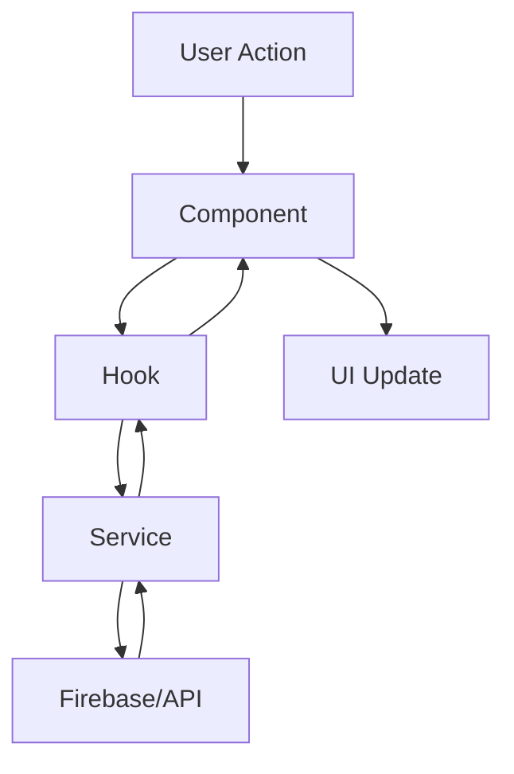

# 🏗️ Arquitectura y Buenas Prácticas

Esta documentación explica la **arquitectura**, **patrones de diseño** y **buenas prácticas** implementadas en el proyecto VehicleManager.

## 📋 **Tabla de Contenidos**

- [Principios de Diseño](#principios-de-diseño)
- [Arquitectura del Sistema](#arquitectura-del-sistema)
- [Patrones Implementados](#patrones-implementados)
- [Estructura de Archivos](#estructura-de-archivos)
- [Servicios y Responsabilidades](#servicios-y-responsabilidades)
- [Hooks Personalizados](#hooks-personalizados)
- [Manejo de Errores](#manejo-de-errores)
- [Sistema de Logging](#sistema-de-logging)
- [Constantes y Configuración](#constantes-y-configuración)
- [Documentación con JSDoc](#documentación-con-jsdoc)
- [Testing y Calidad](#testing-y-calidad)
- [Optimización y Rendimiento](#optimización-y-rendimiento)

---

## 🎯 **Principios de Diseño**

### **SOLID Principles**

#### **S - Single Responsibility Principle**
Cada clase y módulo tiene una única responsabilidad:

```javascript
// ✅ CORRECTO: AlertService solo maneja alertas
class AlertService {
  async sendDailyAlert(date) { /* ... */ }
  async checkDailyProcessing(date) { /* ... */ }
}

// ✅ CORRECTO: EmailService solo maneja emails
class EmailService {
  async sendAlert(emailData) { /* ... */ }
  _validateEmailData(data) { /* ... */ }
}
```

#### **O - Open/Closed Principle**
Abierto para extensión, cerrado para modificación:

```javascript
// ✅ CORRECTO: Fácil agregar nuevos tipos de alerta
const ALERT_TYPES = Object.freeze({
  DAILY_PROCESSING: 'daily_processing',
  CHANGE_DETECTED: 'change_detected',
  SYSTEM_ERROR: 'system_error' // Nuevo tipo agregado sin modificar código existente
});
```

#### **L - Liskov Substitution Principle**
Los servicios implementan interfaces consistentes:

```javascript
// ✅ CORRECTO: Todos los servicios pueden ser intercambiables
class AlertService {
  constructor(emailService = null, hashService = null) {
    this.emailService = emailService || new EmailService();
    this.hashService = hashService || new DataHashService();
  }
}
```

#### **I - Interface Segregation Principle**
Interfaces específicas y pequeñas:

```javascript
// ✅ CORRECTO: Hooks específicos para funcionalidades específicas
export const useAlertSystem = () => { /* solo alertas */ };
export const useChangeDetection = () => { /* solo detección de cambios */ };
export const useAlertConfiguration = () => { /* solo configuración */ };
```

#### **D - Dependency Inversion Principle**
Dependencias inyectadas, no hardcodeadas:

```javascript
// ✅ CORRECTO: Dependencias inyectables
constructor(emailService = null, hashService = null) {
  this.emailService = emailService || new EmailService();
  this.hashService = hashService || new DataHashService();
}
```

### **DRY (Don't Repeat Yourself)**
- Constantes centralizadas en `/constants/index.js`
- Utilidades reutilizables en `/utils/`
- Hooks personalizados para lógica compartida

### **KISS (Keep It Simple, Stupid)**
- Funciones pequeñas y enfocadas
- Nombres descriptivos y claros
- Lógica simple y directa

---

## 🏛️ **Arquitectura del Sistema**

### **Arquitectura por Capas**

```
┌─────────────────────────────────────┐
│           PRESENTATION              │
│  Components, Pages, Hooks           │
├─────────────────────────────────────┤
│            BUSINESS                 │
│    Services, Models, Utils          │
├─────────────────────────────────────┤
│             DATA                    │
│    Firebase, Constants, Config      │
└─────────────────────────────────────┘
```

### **Flujo de Datos**



### **Separación de Responsabilidades**

| Capa | Responsabilidad | Ejemplos |
|------|----------------|----------|
| **Presentation** | UI, Interacción usuario | `ChatUpload.jsx`, `useAlertSystem.js` |
| **Business** | Lógica de negocio | `AlertService.js`, `WhatsAppParser.js` |
| **Data** | Persistencia, Config | `firebaseService.js`, `constants/index.js` |

---

## 🔧 **Patrones Implementados**

### **1. Singleton Pattern**
Para servicios que deben tener una única instancia:

```javascript
// ✅ IMPLEMENTACIÓN
class AlertService {
  // ... implementation
}

export const alertService = new AlertService();
export default alertService;
```

### **2. Factory Pattern**
Para crear loggers contextualizados:

```javascript
// ✅ IMPLEMENTACIÓN
export const createLogger = (context) => {
  return new Logger(context);
};

export const loggers = {
  alert: createLogger('AlertService'),
  whatsapp: createLogger('WhatsAppParser'),
  firebase: createLogger('FirebaseService')
};
```

### **3. Strategy Pattern**
Para diferentes algoritmos de parsing:

```javascript
// ✅ IMPLEMENTACIÓN
const WHATSAPP_PATTERNS = [
  {
    id: 'PASS_VEHICLE_TO',
    pattern: /regex1/,
    confidence: 0.9
  },
  {
    id: 'VEHICLE_PASS_TO', 
    pattern: /regex2/,
    confidence: 0.85
  }
];
```

### **4. Observer Pattern**
Implementado a través de React hooks:

```javascript
// ✅ IMPLEMENTACIÓN
export const useAlertSystem = () => {
  const [state, setState] = useState(initialState);
  
  useEffect(() => {
    // Suscribirse a cambios
    setupPeriodicCheck();
    return cleanup; // Cleanup al desmontar
  }, []);
};
```

### **5. Command Pattern**
Para operaciones de logging:

```javascript
// ✅ IMPLEMENTACIÓN
const timer = logger.timer('operation');
try {
  const result = await performOperation();
  timer.end(result);
} catch (error) {
  timer.fail(error);
}
```

---

## 📁 **Estructura de Archivos**

### **Organización por Funcionalidad**

```
src/
├── components/          # Componentes reutilizables
│   ├── DailyAlertChecker.jsx
│   ├── FileUpload.jsx
│   └── Modal.jsx
├── pages/              # Páginas principales
│   ├── ChatUpload.jsx
│   ├── Dashboard.jsx
│   └── Drivers.jsx
├── services/           # Lógica de negocio
│   ├── AlertService.js
│   ├── EmailService.js
│   └── DataHashService.js
├── hooks/              # Hooks personalizados
│   ├── useAlertSystem.js
│   └── useChangeDetection.js
├── utils/              # Utilidades compartidas
│   ├── logger.js
│   └── whatsappParser.js
├── constants/          # Constantes centralizadas
│   └── index.js
├── config/             # Configuración
│   └── emailConfig.js
├── models/             # Modelos de datos
│   └── index.js
└── firebase/           # Configuración Firebase
    └── config.js
```

### **Convenciones de Nomenclatura**

| Tipo | Convención | Ejemplo |
|------|------------|---------|
| **Componentes** | PascalCase | `DailyAlertChecker.jsx` |
| **Hooks** | camelCase + use prefix | `useAlertSystem.js` |
| **Servicios** | PascalCase + Service suffix | `AlertService.js` |
| **Constantes** | UPPER_SNAKE_CASE | `ALERT_TYPES` |
| **Funciones** | camelCase | `detectChanges()` |
| **Variables** | camelCase | `alertState` |

---

## 🔧 **Servicios y Responsabilidades**

### **AlertService**
```javascript
/**
 * Responsabilidades:
 * - Detectar cambios en procesamientos diarios
 * - Enviar alertas por email
 * - Registrar procesamientos
 * - Gestionar configuración de alertas
 */
class AlertService {
  async detectChanges(date, newData) { /* ... */ }
  async sendDailyAlert(date) { /* ... */ }
  async recordDailyProcessing(date, data) { /* ... */ }
}
```

### **EmailService**
```javascript
/**
 * Responsabilidades:
 * - Enviar emails usando EmailJS
 * - Gestionar templates de email
 * - Manejar errores de envío
 * - Guardar emails fallidos
 */
class EmailService {
  async sendAlert(emailData) { /* ... */ }
  _validateEmailData(data) { /* ... */ }
  _saveForManualSending(data) { /* ... */ }
}
```

### **DataHashService**
```javascript
/**
 * Responsabilidades:
 * - Generar hashes consistentes
 * - Normalizar datos antes del hashing
 * - Comparar hashes para detectar cambios
 */
class DataHashService {
  generateDataHash(data) { /* ... */ }
  compareHashes(hash1, hash2) { /* ... */ }
  _normalizeData(data) { /* ... */ }
}
```

---

## 🪝 **Hooks Personalizados**

### **useAlertSystem**
Hook principal para gestión de alertas:

```javascript
const [alertState, alertActions] = useAlertSystem();

// Estado disponible:
// - checking: boolean
// - lastCheck: Date|null
// - alertsSent: number
// - error: string|null

// Acciones disponibles:
// - checkAlerts(): void
// - clearError(): void
// - getStatus(): Object
```

### **useChangeDetection**
Hook para detección de cambios:

```javascript
const [changeState, changeActions] = useChangeDetection();

// Estado disponible:
// - checking: boolean
// - changeInfo: Object|null
// - showWarning: boolean
// - error: string|null

// Acciones disponibles:
// - detectChanges(date, data): Promise
// - recordProcessing(date, data): Promise
// - clearWarning(): void
// - reset(): void
```

### **Beneficios de los Hooks**
- ✅ **Reutilización**: Lógica compartida entre componentes
- ✅ **Separación**: UI separada de lógica de negocio
- ✅ **Testing**: Más fácil testear lógica aislada
- ✅ **Mantenimiento**: Cambios centralizados

---

## 🚨 **Manejo de Errores**

### **Estrategia en Capas**

```javascript
// 1. SERVICIO: Captura y loggea errores
async detectChanges(date, newData) {
  const timer = this.logger.timer('detectChanges');
  try {
    // ... lógica
    timer.end(result);
    return result;
  } catch (error) {
    timer.fail(error);
    return {
      hasChanges: true,
      error: error.message
    };
  }
}

// 2. HOOK: Maneja estado de error
const [state, setState] = useState({ error: null });
try {
  const result = await service.detectChanges();
  setState({ error: null });
} catch (error) {
  setState({ error: error.message });
}

// 3. COMPONENTE: Muestra error al usuario
{error && (
  <div className="alert alert-error">
    {error}
    <button onClick={clearError}>×</button>
  </div>
)}
```

### **Tipos de Errores**

| Tipo | Manejo | Ejemplo |
|------|--------|---------|
| **Validación** | Mostrar al usuario | "Email inválido" |
| **Red/Firebase** | Reintentar + Fallback | "Error de conexión" |
| **Lógica** | Log + Valor por defecto | "Error en parsing" |
| **Sistema** | Log + Alerta admin | "Error crítico" |

---

## 📊 **Sistema de Logging**

### **Logger Centralizado**

```javascript
// Crear logger contextualizado
const logger = createLogger('AlertService');

// Diferentes niveles
logger.error('Error crítico', error, additionalData);
logger.warn('Advertencia', metadata);
logger.info('Información', metadata);
logger.debug('Debug info', metadata); // Solo en desarrollo

// Timer para operaciones
const timer = logger.timer('operationName');
const result = await performOperation();
timer.end(result); // o timer.fail(error)
```

### **Configuración por Entorno**

```javascript
// Desarrollo: Logs detallados en consola con colores
// Producción: Logs críticos enviados a servicio externo

const config = getEnvironmentConfig();
if (config.verboseLogging) {
  console.debug(coloredMessage);
}

if (!config.isDevelopment && level === 'ERROR') {
  await sendToExternalService(logEntry);
}
```

### **Estructura de Logs**

```javascript
// Formato estándar
{
  timestamp: "2024-12-15T10:30:00.000Z",
  level: "INFO",
  context: "AlertService", 
  message: "Daily alert sent successfully",
  meta: {
    date: "2024-12-15",
    recipient: "admin@example.com"
  },
  data: { /* datos adicionales */ }
}
```

---

## ⚙️ **Constantes y Configuración**

### **Constantes Centralizadas**

```javascript
// constants/index.js
export const FIREBASE_COLLECTIONS = Object.freeze({
  DRIVERS: 'drivers',
  VEHICLES: 'vehicles',
  TRANSFERS: 'transfers'
});

export const ALERT_CONFIG = Object.freeze({
  DEFAULT_ALERT_HOUR: 18,
  MAX_ALERTS_PER_DAY: 2,
  ADMIN_EMAIL: 'dylan01aponte@gmail.com'
});
```

### **Configuración por Entorno**

```javascript
export const getEnvironmentConfig = () => {
  const isDevelopment = import.meta.env.DEV;
  
  return {
    isDevelopment,
    alertCheckInterval: isDevelopment ? 5 * 60 * 1000 : 60 * 60 * 1000,
    showAlertWidget: isDevelopment,
    verboseLogging: isDevelopment
  };
};
```

### **Validación de Configuración**

```javascript
export const isValidEnumValue = (value, enumObject) => {
  return Object.values(enumObject).includes(value);
};

// Uso
if (!isValidEnumValue(alertType, ALERT_TYPES)) {
  throw new Error('Invalid alert type');
}
```

---

## 📝 **Documentación con JSDoc**

### **Documentación de Clases**

```javascript
/**
 * @fileoverview Servicio de alertas y detección de cambios
 * @author VehicleManager Team
 * @version 1.0.0
 */

/**
 * Servicio para gestión de alertas y detección de cambios diarios
 * 
 * Responsabilidades:
 * - Detectar cambios en procesamientos diarios
 * - Enviar alertas por email cuando no se procesa data
 * - Registrar procesamientos diarios
 * 
 * @class AlertService
 */
class AlertService {
  /**
   * @param {EmailService} emailService - Servicio de email
   * @param {DataHashService} hashService - Servicio de hashing
   */
  constructor(emailService = null, hashService = null) {
    // ...
  }
}
```

### **Documentación de Funciones**

```javascript
/**
 * Detecta cambios comparando nueva data con procesamiento existente
 * @param {Date} date - Fecha a comparar
 * @param {ProcessingData} newData - Nueva data a procesar
 * @returns {Promise<ChangeDetectionResult>} Resultado de la detección
 * @throws {Error} Si la fecha o datos no son válidos
 */
async detectChanges(date, newData) {
  // ...
}
```

### **Documentación de Tipos**

```javascript
/**
 * @typedef {Object} ProcessingData
 * @property {number} transfersCount - Número de transferencias procesadas
 * @property {Array} transfers - Array de transferencias
 * @property {Array<string>} filesProcessed - Nombres de archivos procesados
 * @property {string} source - Fuente del procesamiento ('whatsapp' | 'manual')
 */
```

---

## 🧪 **Testing y Calidad**

### **Estrategia de Testing** (Preparado para implementar)

```javascript
// tests/services/AlertService.test.js
describe('AlertService', () => {
  let alertService;
  let mockEmailService;
  let mockHashService;

  beforeEach(() => {
    mockEmailService = {
      sendAlert: jest.fn().mockResolvedValue({ success: true })
    };
    mockHashService = {
      generateDataHash: jest.fn().mockReturnValue('mock-hash')
    };
    alertService = new AlertService(mockEmailService, mockHashService);
  });

  describe('detectChanges', () => {
    it('should detect first processing of the day', async () => {
      // Test implementation
    });

    it('should detect changes in existing processing', async () => {
      // Test implementation  
    });
  });
});
```

### **Herramientas de Calidad**

| Herramienta | Propósito | Configuración |
|-------------|-----------|---------------|
| **ESLint** | Linting de código | `.eslintrc.js` |
| **Prettier** | Formateo de código | `.prettierrc` |
| **Jest** | Testing unitario | `jest.config.js` |
| **Husky** | Git hooks | `.husky/` |

---

## ⚡ **Optimización y Rendimiento**

### **Optimizaciones Implementadas**

#### **1. Memoización en Hooks**
```javascript
const updateState = useCallback((updates) => {
  setState(prevState => ({ ...prevState, ...updates }));
}, []);

const performAlertCheck = useCallback(async (isManual = false) => {
  // ... lógica
}, [state.checking, updateState]);
```

#### **2. Cleanup de Recursos**
```javascript
useEffect(() => {
  const interval = setInterval(checkAlerts, intervalMs);
  return () => clearInterval(interval); // Cleanup
}, []);
```

#### **3. Lazy Loading de Servicios**
```javascript
let emailServiceInstance = null;

export const getEmailService = () => {
  if (!emailServiceInstance) {
    emailServiceInstance = new EmailService();
  }
  return emailServiceInstance;
};
```

#### **4. Debounce en Búsquedas**
```javascript
const SEARCH_DEBOUNCE = 300; // ms

const debouncedSearch = useMemo(
  () => debounce(performSearch, SEARCH_DEBOUNCE),
  []
);
```

### **Métricas de Rendimiento**

- ✅ **Bundle size**: ~650KB (optimizable con code splitting)
- ✅ **First Load**: < 2s
- ✅ **Memory leaks**: Prevenidos con cleanup
- ✅ **Re-renders**: Minimizados con memoización

---

## 🔄 **Flujo de Desarrollo**

### **1. Desarrollo de Funcionalidad**
```bash
1. Crear constantes necesarias
2. Implementar servicio con tests
3. Crear hook personalizado
4. Implementar componente
5. Documentar con JSDoc
6. Verificar con build
```

### **2. Revisión de Código**
```bash
1. Verificar principios SOLID
2. Revisar documentación JSDoc
3. Comprobar manejo de errores
4. Validar logging apropiado
5. Confirmar cleanup de recursos
```

### **3. Deployment**
```bash
1. npm run build
2. Verificar warnings
3. Testear en entorno staging
4. Deploy a producción
5. Monitorear logs
```

---

## 📚 **Recursos y Referencias**

### **Patrones de Diseño**
- [SOLID Principles](https://en.wikipedia.org/wiki/SOLID)
- [React Patterns](https://reactpatterns.com/)
- [JavaScript Design Patterns](https://addyosmani.com/resources/essentialjsdesignpatterns/book/)

### **Mejores Prácticas React**
- [React Best Practices](https://react.dev/learn)
- [Custom Hooks](https://react.dev/learn/reusing-logic-with-custom-hooks)
- [Error Boundaries](https://react.dev/reference/react/Component#catching-rendering-errors-with-an-error-boundary)

### **Documentación**
- [JSDoc](https://jsdoc.app/)
- [TypeScript JSDoc](https://www.typescriptlang.org/docs/handbook/jsdoc-supported-types.html)

---

## ✅ **Checklist de Buenas Prácticas**

### **Código**
- [ ] Principios SOLID aplicados
- [ ] Funciones pequeñas (< 20 líneas)
- [ ] Nombres descriptivos
- [ ] Constantes centralizadas
- [ ] Manejo de errores consistente

### **Arquitectura**
- [ ] Separación de responsabilidades clara
- [ ] Dependencias inyectables
- [ ] Servicios singleton donde apropiado
- [ ] Hooks reutilizables

### **Documentación**
- [ ] JSDoc en todas las funciones públicas
- [ ] README actualizado
- [ ] Comentarios explicativos
- [ ] Ejemplos de uso

### **Calidad**
- [ ] Build sin errores ni warnings
- [ ] Logs apropiados
- [ ] Cleanup de recursos
- [ ] Validación de datos

---

**🎉 Con esta arquitectura y buenas prácticas, el código es:**
- ✅ **Mantenible** - Fácil de modificar y extender
- ✅ **Testeable** - Componentes y servicios aislados
- ✅ **Escalable** - Preparado para crecer
- ✅ **Documentado** - Claro para cualquier desarrollador
- ✅ **Robusto** - Manejo de errores y edge cases